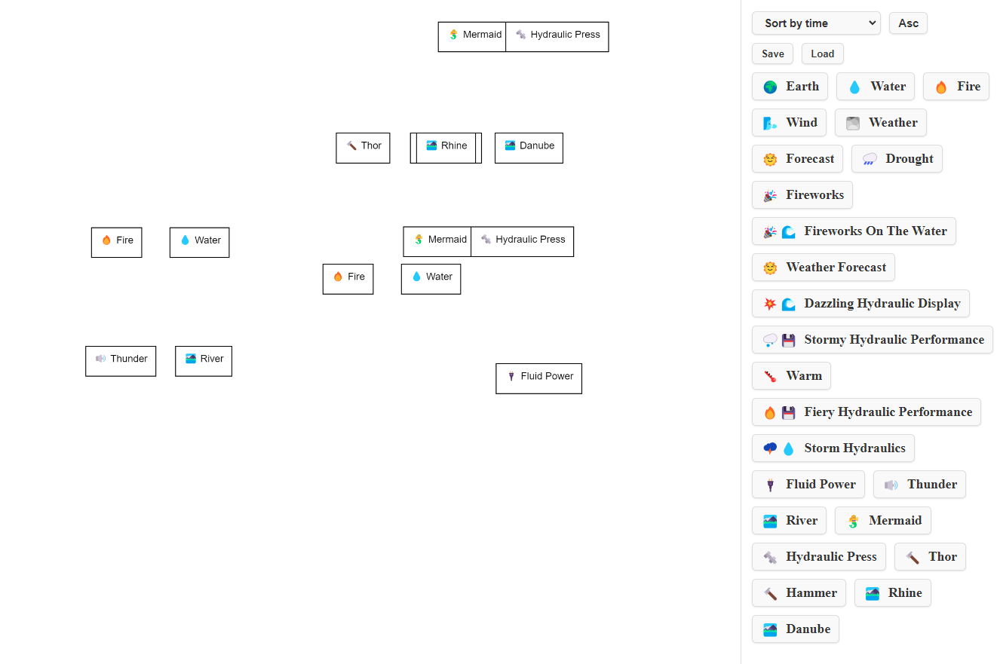

## To run:
### Install llama model
`cd models && git clone https://huggingface.co/TheBloke/Llama-2-7B-Chat-GPTQ --branch gptq-4bit-32g-actorder_True --single-branch`

### Install infinicraft loras
`cd loras && git clone https://huggingface.co/CharlesFauman/infini_craft`

### Install scripts (See scripts README)
Once you've followed ALL OF THOSE INSTRUCTIONS, you can run `uvicorn infini_craft.server:app --reload` from the scripts directory

give it a few seconds to start

### Run UI
(cd ui && bun install && bun run dev)

### go to  http://localhost:5173/

Enjoy!